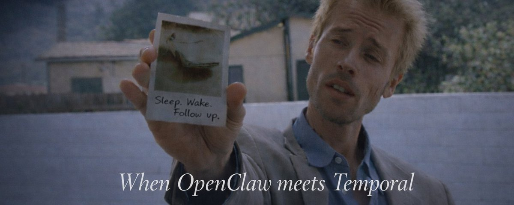

## NOTE: This is a personal project, not production-grade

# Memento



> **Most of what I want agents to do isn't a prompt. It's a goal.**

Memento is an exploration artifact. I'm testing a thesis: agents become materially useful when they're embedded in **durable workflows** that let them sleep, wake on real signals, and keep pursuing a goal across days — not when they're treated as one-shot prompt responders.

## The thesis

Real async coordination is messy. People ghost. Deadlines slip. Context evaporates. "Ask the contractor if they can start work on Friday" isn't a function call — it's following up over multiple days because most people are busy. The thing I actually want is an agent that can sleep for three days, wake up, notice the contractor still hasn't replied, and nudge them. Without me prompting it. Without a cronjob I have to babysit. Without losing the thread.

The hard part is not just reasoning; it's **continuity**.

## What it is

Memento is what you get when you take [OpenClaw](https://openclaw.ai/) (the Pi agent harness) and run every turn inside [Temporal](https://temporal.io/), a durable workflow engine. Sleep and signals become first-class tools. Every wake-up is tagged with *why* it happened. The entire causal model of an agent's life compresses to this:

```ts
while (true) {
  const trigger = await race([
    sleep(nextWakeAt),               // timer fired
    onSignal("on_email"),            // someone replied
    onSignal("on_owner_response"),   // I (the human) said something
    onSignal("on_schedule"),         // a timer the agent set for itself
  ]);

  const outcome = await runAgentTurn(trigger);

  if (outcome.decision === "sleep") nextWakeAt = outcome.wakeAt;
  else if (outcome.decision === "complete") break;
}
```

Signals are *real* signals: "a new email arrived for `myagent@agentmail.to`" gets routed to the right running workflow and wakes it without losing state.

## Lou, the proof point

Lou is my household grocery coordinator. He starts a cart every Tuesday and Thursday, emails the family for additions, and places the order via Browserbase once it hits 2pm. On the morning of April 10th he woke himself up after exactly 86,400,000ms of sleep, noticed no one had replied, and nudged the thread. Lou is a proof point, not the product.

## What I'm still figuring out

- **The wedge.** Is the right shape here infrastructure, a productized workflow layer, or something that lives *on top of* OpenClaw rather than apart from it? I genuinely don't know yet — that's part of what I'm trying to learn.
- **Trust and autonomy.** Where does trust break? How much autonomy do people actually want to grant an agent that acts on their behalf while they're not watching?

I have a direction, not fake certainty. If any of this resonates — or if you think the thesis is wrong — I'd love to hear it.

## Read more

[**Memento: agents that sleep, wake, and follow up**](https://x.com/pirosb3/status/2042993411473518656) — the longer-form write-up on X.

## Code quality checks

Run these commands locally (or after automated agent edits):

```bash
pnpm lint          # oxlint (repo-wide)
pnpm typecheck        # TypeScript checks for shared + email-gateway
pnpm typecheck:web    # web-only typecheck
pnpm typecheck:worker # worker-only typecheck
pnpm quality       # lint + typecheck
pnpm quality:agent # fast post-agent gate (oxlint + typecheck)
pnpm lint:web      # optional: run Next.js/React eslint rules for web package
```
